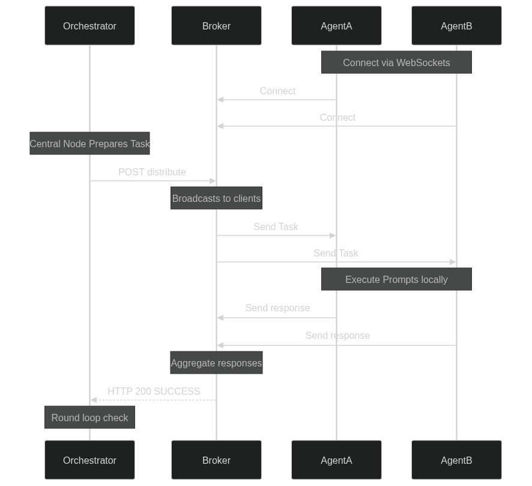
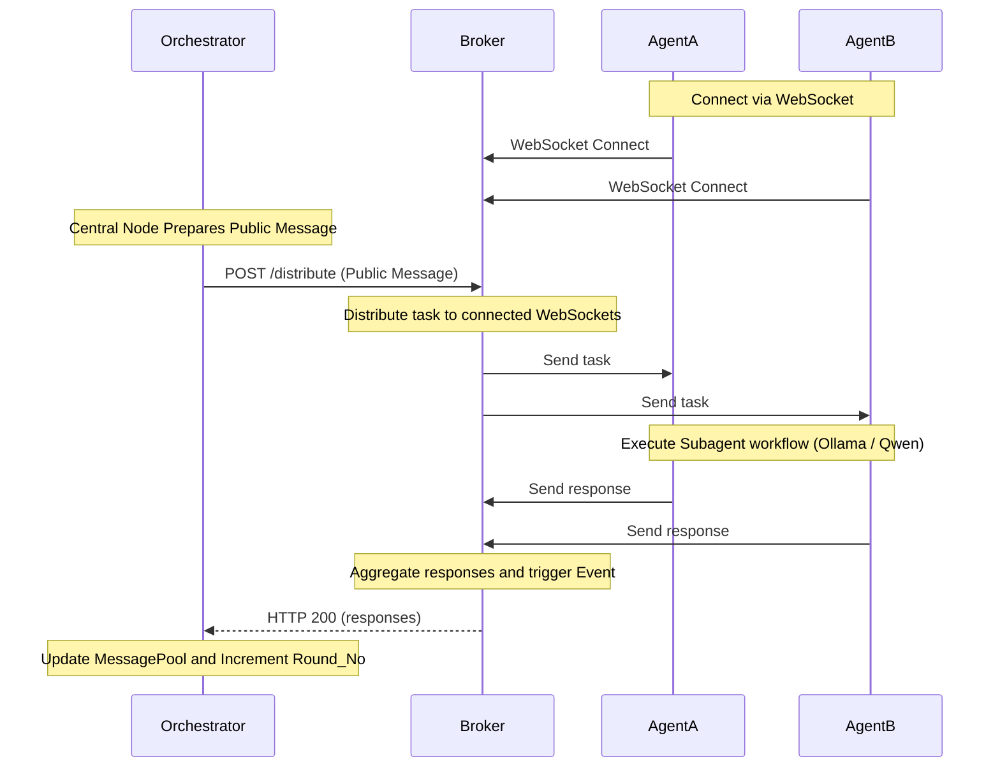
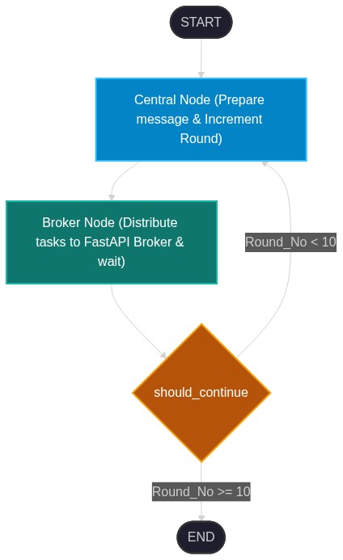
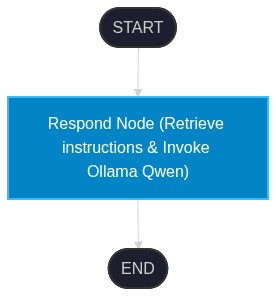

# Agents Cluster: Distributed Multi-Agent Coordination Framework

An elegant, distributed multi-agent compute architecture powered by **LangGraph**, **FastAPI**, **WebSockets**, and local LLMs (**Ollama / Qwen**). 

This framework establishes a central orchestrator that coordinates tasks across a cluster of distributed subagents. Communication is orchestrated via a centralized message broker, allowing subagents to connect asynchronously from anywhere (via WebSockets), run computations locally, and feed results back to the central state machine.

---

## Architecture Overview

The system operates in a hub-and-spoke model where the **Orchestrator** (the hub) designs and routes tasks, the **Broker** serves as the communications channel, and the **Subagents** (spokes) process individual instructions.





---

### LangGraph Workflow Graphs

#### 1. Orchestrator Graph Flow
This graph defines the execution cycle of the central orchestrator, controlling round-based iterations:

```mermaid
graph TD
    StartNode([START]) --> CentralNode[Central Node: Prepare message and Increment Round]
    CentralNode --> BrokerNode[Broker Node: Distribute tasks to FastAPI Broker and wait]
    BrokerNode --> DecisionNode{should_continue}
    DecisionNode -->|Round_No is less than 10| CentralNode
    DecisionNode -->|Round_No is 10 or more| EndNode([END])
    
    style StartNode fill:#1e1e2f,stroke:#333,stroke-width:2px;
    style EndNode fill:#1e1e2f,stroke:#333,stroke-width:2px;
    style CentralNode fill:#0284c7,stroke:#38bdf8,stroke-width:2px,color:#fff;
    style BrokerNode fill:#0f766e,stroke:#14b8a6,stroke-width:2px,color:#fff;
    style DecisionNode fill:#b45309,stroke:#f59e0b,stroke-width:2px,color:#fff;
```





#### 2. Subagent Graph Flow
This graph defines the execution path inside each subagent worker client:

```mermaid
graph TD
    StartNode([START]) --> RespondNode[Respond Node: Retrieve instructions and Invoke Ollama Qwen]
    RespondNode --> EndNode([END])

    style StartNode fill:#1e1e2f,stroke:#333,stroke-width:2px;
    style EndNode fill:#1e1e2f,stroke:#333,stroke-width:2px;
    style RespondNode fill:#0284c7,stroke:#38bdf8,stroke-width:2px,color:#fff;
```





## Component Directory & Structure

- 📄 [schemas.py](file:///c:/Users/AYUSH/Agents-Cluster/schemas.py): Contains the standard definition of `AgentState` (the state shared across the Orchestrator's execution).
- 📄 [Orchestrator.py](file:///c:/Users/AYUSH/Agents-Cluster/Orchestrator.py): The main LangGraph coordinator defining a state graph (`Central Node` $\rightarrow$ `Broker Node` $\rightarrow$ conditional loops up to 10 rounds).
- 📄 [broker.py](file:///c:/Users/AYUSH/Agents-Cluster/broker.py): The FastAPI application handling WebSockets and acting as the HTTP REST broker for triggering task distributions.
- 📁 [subagent/](file:///c:/Users/AYUSH/Agents-Cluster/subagent/):
  - 📄 [subagent.py](file:///c:/Users/AYUSH/Agents-Cluster/subagent/subagent.py): A LangGraph agent with checkpointer memory using `ChatOllama` with the `qwen2.5:1.5b` model.
  - 📄 [app.py](file:///c:/Users/AYUSH/Agents-Cluster/subagent/app.py): The client daemon that connects to the broker via WebSockets, waits for tasks, invokes the local LangGraph subagent (with exponential backoff retries), and submits responses.
- 📄 [verify.py](file:///c:/Users/AYUSH/Agents-Cluster/verify.py): A simple verification script to test a sample workflow through the orchestrator.

---

## Prerequisites

Make sure you have the following installed and running:
1. **Python 3.10+**
2. **Ollama**: Install [Ollama](https://ollama.com/) and run the Qwen 2.5 1.5B model:
   ```bash
   ollama run qwen2.5:1.5b
   ```
3. **Required Python packages**:
   Install dependencies using:
   ```bash
   pip install fastapi uvicorn langgraph langchain_core langchain_ollama websockets httpx python-dotenv
   ```

---

## Running the Cluster

Follow these steps to run the cluster locally:

### Step 1: Start the Broker
The broker manages the WebSocket pool and orchestrator-subagent routing.
Run it using `uvicorn`:
```bash
uvicorn distributed_compute.broker:app --host 127.0.0.1 --port 8000
```

### Step 2: Connect Subagent Clients
You can connect multiple subagent clients. Run the subagent script:
```bash
python -m distributed_compute.subagent.app
```
*Note: You can duplicate this file or change the `AGENT_ID` in `subagent/app.py` to spawn multiple worker nodes.*

### Step 3: Run the Orchestrator / Verification
With the Broker running and at least one Subagent connected, launch the main workflow:
```bash
python -m distributed_compute.verify
```
Or run the orchestrator graph directly:
```bash
python -m distributed_compute.Orchestrator
```

---

## Execution Flow Detail

1. **Agent State**: `AgentState` represents the orchestrator state tracking the instructions, global message pool, current round number, and latest public message.
2. **Central Node**: Prepares the instruction, adding standard professional guidelines.
3. **Broker Node**: POSTs the instruction to the FastAPI Broker.
4. **WebSocket Distribution**: The Broker broadcasts the task to all registered WebSockets.
5. **Worker Execution**: Subagents invoke local LangGraph subagent instances using Ollama (`qwen2.5:1.5b`), process the task, and return the answer via WebSockets.
6. **Aggregation**: The Broker waits for all connected subagents to respond, packages the results, and returns them to the Orchestrator, which saves them in the `MessagePool`.
7. **Looping**: The orchestration runs for up to 10 sequential rounds of interaction.